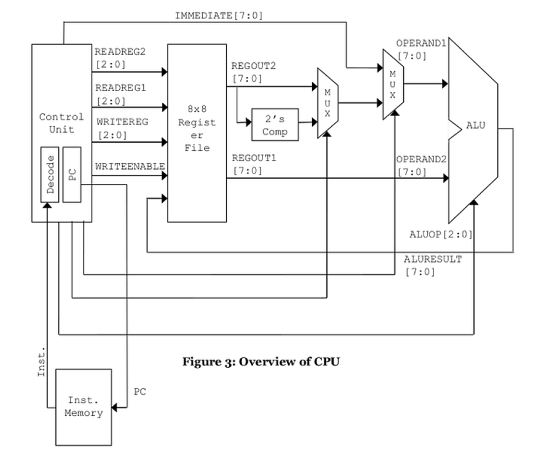
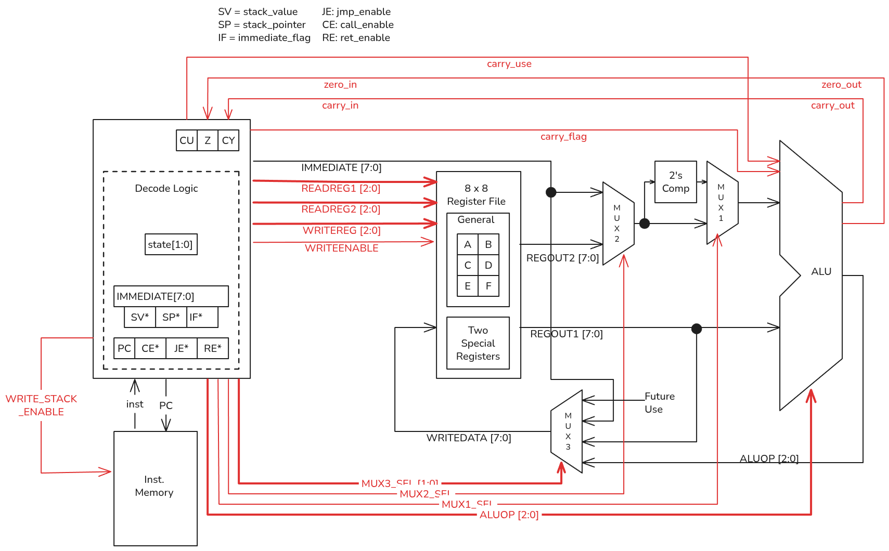
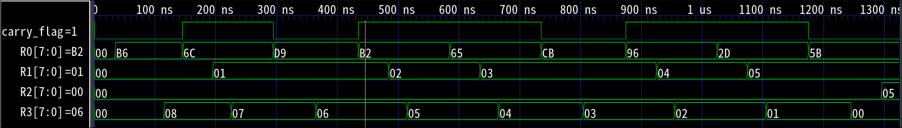
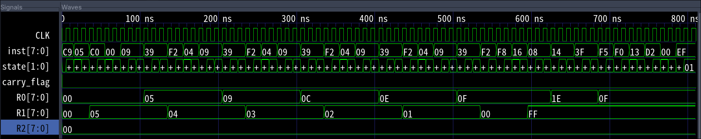
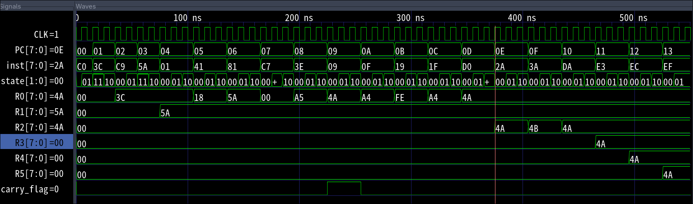
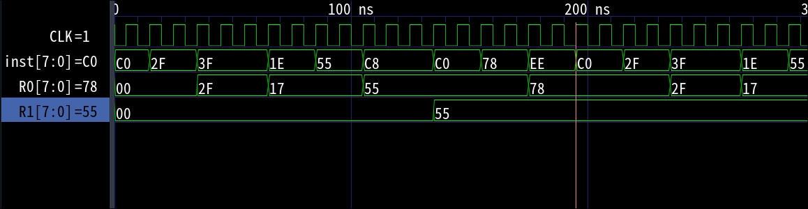

# FPGA Lab Session:
## LAB Submission 1
### Implement Control Unit for 8 bit CPU
---

#### Table of Contents
1. [Introduction to the Repo](#introduction)
2. [Lab Intro](#introduction-to-lab-session)
3. [Coding Environment](#environment)
4. [Usage and Output](#usage)

---

### Introduction
This repository serves as the assignment submission for Elective Classes on FPGA course for:
| Name  | Arun Pankaj Bhatta |
| -------------- | --------------- |
| Roll no. | 079BEI008 |

During the session of Lab-3, we were instructed to complete our cpu as well as test in Vivado software, based on architecture as presented below in the figure provided by the lab instructor:

After the lab session, we were tasked to complete the entire CPU with the following title of assignment
> `Submit the completed 8-bit Processor Lab Project that was finished during the lab session after completing the previous assignment.`

For the submission, here are the verilog files (.v) with their testbenches.

Also, provided is the new architecture that was more detailed and was customized to fit my view.



---

### Introduction to Lab Session

The lab, conducted on July 2 and July 9, 2026 was our first proper session of start to finish of a complete module.

Since the control unit was already done in the previous week, it was simple task to hook everything to a top module and start debugging. The main, and only, challenge was to figure out which instruction needed which set of signals and more importantly, when. Once each part came together, there really was no real effort needed.

Hence, for sanity's sake, I created the [CPU Architecture](./cpu_architecture.md) file, to store all the ideas, and what we needed to do. At the start it was basically a 1:1 copy of the above figure, but slowly it morphed into my realization of the CPU. The file has 2 parts: Architecture Discussion and Instruction Set. Not much is described in the file except for very raw facts that one needs to know about this CPU design. And once, I had a reference on what to do, with the help of this [Google Sheet](https://docs.google.com/spreadsheets/d/1HAe2VzfGsogN4_n9ZDZejeOMXLIFRrK1n7Pcw1E7xAo/edit?usp=sharing), i carefully mapped out what instructions went where.

From past experience in 8085/86 and Instrumentation, I could make a meaningful ISA which then was step by step decoded in the CU.

---

### Environment

1. Softwares used:
    - Neovim
      - with installed LSP of `verible` and `svlangserver`.
      - For markdown preview with [`markdown-preview`](https://github.com/iamcco/markdown-preview.nvim).
    - VScode
        - with installed extension slang-server: `Verilog/SystemVerilog`
        - with formatter: `VeriGood - SystemVerilog/Verilog Formatter`
	- Obisidian
		- For using excali draw to draw up my architecture.
2. Directory Structure:
    - Root:
        - The root folder contains the actual assignment: the model, its testbenches, output file and gtk wave. It also contains lab-session folder.
    - Images:
	    - To store screenshots of testbench and figures
	- cpu_test_conditions:
		- To store multiple instruction memory for multiple types of testing the `cpu.v` testbench module.
		- These are the past testbenches that were once made, and then discarded because new function needed to be tested.
3. Compile and Simulation:
    - `iverilog` was used for compiling.
    - `gtkwave` was used for observing simulation.
---

### Usage
Steps:
1. To use the repo, simply clone it: ```git clone https://github.com/waraunika/fpga-lab-1```
2. Have `iverilog` and `gtkwave` installed on your system.
3. Inside root folder, run: ```iverilog -o cpu alu.v inst_memory.v mux_2x1.v register_file.v twos_comp.v cu.v mux_4x1.v cpu.v```
4. The output is present as `cpu` file
5. Run: `vvp cpu`
6. Run: `gtkwave cpu.vcd` (file name depends on what is set by testbench)

Point to be noted:
- Since I have many instructions, i have categorized them individually for their instruction type. and created a [test_conditions](./test_conditions) directory.
- This directory houses one folder for each category of instruction.
- Each folder then contains 2 files:
	- inst_memory.v: the instructions for the control unit to get
	- control_unit_tb.v: the actual testbench.
- Just replace the content of root directory by the respective testbench and instruction memory module.
- and rerun the compilation/simulation for desired instruction type.

#### ALU Itself
- The ALU has 8 operations:
  - 000 : AND
  - 001 : OR
  - 010 : XOR
  - 011 : NOR
  - 100 : ADD
  - 101 : SBB
  - 110 : RL (Rotate Left: ROL/RLC)
  - 111 :  RR (Rotate Right: ROR/RRC)
- Some more description can be found in [CPU Architecture](./cpu_architecture.md)

#### Screenshots

1. Output for Bit Counter program in Reg 0: output = 5 in Reg 2.


2. Sum of first 5 Natural Numbers.:


3. Output for arithmetic and logical instructions:


4. Sample operations where we can loop through RST operation:

